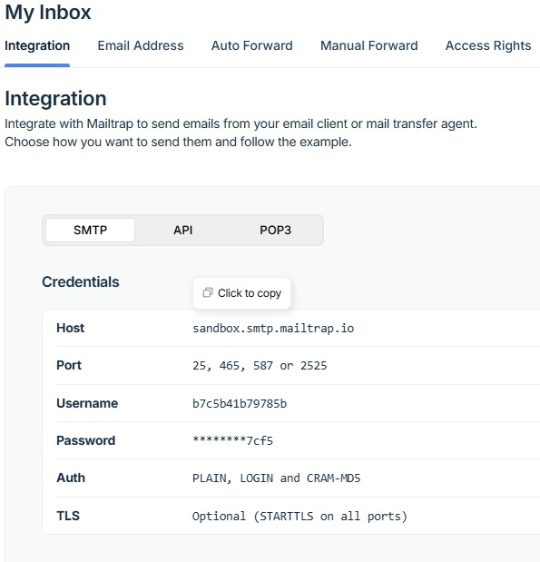
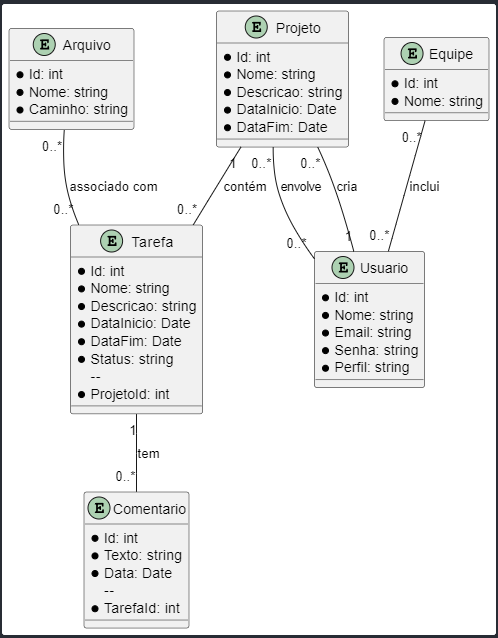

# Projeto de Gerenciamento de Tarefas e Equipes

Este projeto é uma API para gerenciar tarefas, equipes, projetos e usuários. A API fornece endpoints para criar, atualizar, excluir e listar itens, além de gerenciar arquivos e comentários associados ás tarefas.

## Funcionalidades Principais
- Gerenciamento de tarefas, projetos, equipes e usuários.
- Controle de arquivos associados a tarefas.
- Sistema de comentários em tarefas.
- Autenticação e registro de usuários.
- Controle de participação em equipes.

---

## Endpoints da API

### **Arquivo**
- **Adicionar Arquivo a uma Tarefa**  
  `POST /api/Arquivo/{tarefaId}/tarefa`  
  - **Parâmetros**: `tarefaId` (ID da tarefa)  
  - **Body**: `ArquivoCreateModel`  

- **Obter Arquivos de uma Tarefa**  
  `GET /api/Arquivo/{tarefaId}/tarefa`  
  - **Parâmetros**: `tarefaId` (ID da tarefa)  

- **Listar Todas as Tarefas com Arquivos Associados**  
  `GET /api/Arquivo`  

- **Excluir Arquivo pelo ID**  
  `DELETE /api/Arquivo/{arquivoId}`  
  - **Parâmetros**: `arquivoId` (ID do arquivo)  

---

### **Autenticação**
- **Registrar Usuário**  
  `POST /api/Auth/register`  
  - **Body**: `RegisterModel`  

- **Confirmar E-mail**  
  `GET /api/Auth/confirmemail`  
  - **Parâmetros**: `userId`, `token`  

- **Login de Usuário**  
  `POST /api/Auth/login`  
  - **Body**: `LoginModel`  

---

### **Comentários**
- **Adicionar Comentário a uma Tarefa**  
  `POST /api/Comentario/{tarefaId}`  
  - **Parâmetros**: `tarefaId`  
  - **Body**: `ComentarioCreateModel`  

- **Remover Comentário**  
  `DELETE /api/Comentario/{comentarioId}`  
  - **Parâmetros**: `comentarioId`  

- **Listar Comentários de uma Tarefa**  
  `GET /api/Comentario/{tarefaId}/comentarios`  
  - **Parâmetros**: `tarefaId`  

---

### **Equipes**
- **Entrar em uma Equipe**  
  `POST /api/Equipes/EntrarNaEquipe`  
  - **Body**: `EntrarNaEquipeModel`  

- **Sair de uma Equipe**  
  `POST /api/Equipes/SairDaEquipe`  
  - **Body**: `SairDaEquipeModel`  

- **Listar Equipes**  
  `GET /api/Equipes`  

- **Obter Detalhes de uma Equipe**  
  `GET /api/Equipes/{id}`  
  - **Parâmetros**: `id`  

- **Criar Equipe**  
  `POST /api/Equipes/Create`  
  - **Body**: `EquipeCreateModel`  

- **Editar Equipe**  
  `PUT /api/Equipes/Edit/{id}`  
  - **Parâmetros**: `id`  
  - **Body**: `EquipeEditModel`  

- **Excluir Equipe**  
  `DELETE /api/Equipes/Delete/{id}`  
  - **Parâmetros**: `id`  

- **Remover Usuário de uma Equipe**  
  `POST /api/Equipes/RemoverUsuario`  
  - **Body**: `RemoverUsuarioModel`  

---

### **Projetos**
- **Listar Projetos**  
  `GET /api/Projeto`  

- **Criar Novo Projeto**  
  `POST /api/Projeto`  
  - **Body**: `ProjetoCreateModel`  

- **Obter Projeto por ID**  
  `GET /api/Projeto/{id}`  
  - **Parâmetros**: `id`  

- **Editar Projeto**  
  `PUT /api/Projeto/{id}`  
  - **Parâmetros**: `id`  
  - **Body**: `ProjetoEditModel`  

- **Excluir Projeto**  
  `DELETE /api/Projeto/{id}`  
  - **Parâmetros**: `id`  

---

### **Tarefas**
- **Listar Tarefas de um Projeto**  
  `GET /api/Tarefas`  
  - **Parâmetros**: `projetoId`  

- **Obter Tarefa por ID**  
  `GET /api/Tarefas/{id}`  
  - **Parâmetros**: `id`  

- **Excluir Tarefa**  
  `DELETE /api/Tarefas/{id}`  
  - **Parâmetros**: `id`  

- **Criar Nova Tarefa para um Projeto**  
  `POST /api/Tarefas/{projetoId}`  
  - **Parâmetros**: `projetoId`  
  - **Body**: `TarefaCreateModel`  

---

## Tecnologias Utilizadas
- **Backend**: ASP.NET Core  
- **Banco de Dados**: SQL Server  
- **Autenticação**: Identity  
- **Gerenciamento de Dados**: Entity Framework Core  

---

## Como Executar o Projeto
1. Clone este repositório.  
2. Configure as variáveis de ambiente e banco de dados no arquivo `appsettings.json` e rode `Update-Database`.  
3. Execute o comando `dotnet run` para iniciar o servidor.  
4. Utilize ferramentas como Postman ou Swagger para testar os endpoints. (swagger: http://localhost:5110/index.html)  
5. No arquivo \API.projectManager\Controllers\AuthController.cs substituir os dados do mailTrap na função "SendConfirmationEmail" 
- 
- 

### **Entidades**
- **Projeto**  
  - **Atributos**:
    - `Id`: int  
    - `Nome`: string  
    - `Descricao`: string  
    - `DataInicio`: Date  
    - `DataFim`: Date  
  - **Relacionamentos**:
    - Um projeto pode conter várias tarefas (`1..*`).  
    - É criado por um único usuário (`1`).  
    - Pode envolver vários usuários (`0..*`).  

- **Tarefa**  
  - **Atributos**:
    - `Id`: int  
    - `Nome`: string  
    - `Descricao`: string  
    - `DataInicio`: Date  
    - `DataFim`: Date  
    - `Status`: string  
    - `ProjetoId`: int  
  - **Relacionamentos**:
    - Cada tarefa pertence a um projeto (`1`).  
    - Pode conter vários comentários (`0..*`).  
    - Pode estar associada a vários arquivos (`0..*`).  

- **Usuário**  
  - **Atributos**:
    - `Id`: int  
    - `Nome`: string  
    - `Email`: string  
    - `Senha`: string  
    - `Perfil`: string  
  - **Relacionamentos**:
    - Um usuário pode criar vários projetos (`1..*`).  
    - Pode estar envolvido em vários projetos (`0..*`).  
    - Pode participar de várias equipes (`0..*`).  

- **Equipe**  
  - **Atributos**:
    - `Id`: int  
    - `Nome`: string  
  - **Relacionamentos**:
    - Uma equipe pode incluir vários usuários (`0..*`).  

- **Arquivo**  
  - **Atributos**:
    - `Id`: int  
    - `Nome`: string  
    - `Caminho`: string  
  - **Relacionamentos**:
    - Um arquivo pode estar associado a várias tarefas (`0..*`).  

- **Comentário**  
  - **Atributos**:
    - `Id`: int  
    - `Texto`: string  
    - `Data`: Date  
    - `TarefaId`: int  
  - **Relacionamentos**:
    - Cada comentário pertence a uma tarefa (`1`).  
---

## Licença
Este projeto está licenciado sob a [MIT License](LICENSE).
